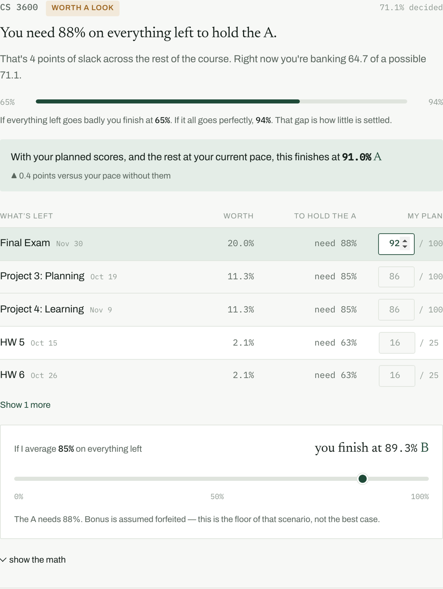

# College Compass

**What do I need on the final to keep my A? Which class can I relax on the most?
Is this homework even worth doing?**

Every week, the same questions. Canvas can tell you what you scored — it cannot
tell you what to do next, because it does not know how your syllabus weights
anything or how many exams are still coming.

College Compass reads your Canvas data through the session you are already
signed into, reconciles it against the grading rules in your syllabus, and
answers the question you actually have: **where does tonight go?**

**[Live demo →](https://college-compass.vercel.app)**



---

## What it answers

- **What do I need on the final?** Not a category average — the actual number,
  on the actual assignment. Every remaining item is listed with its real share
  of your final grade and the score you need on it. *Final Exam, 20.0% of your
  grade, need 88%.*
- **Is this homework even worth doing?** Some items come back marked *skip it,
  you're still fine* — they can score zero without costing you the grade. A
  2.1% homework and a 20% final are not the same task, and nothing else tells
  you which is which.
- **What do I need overall?** One sentence per course: the average you need on
  everything remaining, or the fact that it is already decided either way.
- **Which class can I let go of?** A ranking by *slack*: how many points of the
  remaining course you can throw away and still finish with an A. The course
  with the most slack is the one to spend less on, which nothing else will tell
  you.
- **What if this goes badly?** Drag a slider: *if I average 70% on everything
  left, where do I land?* Bonus is assumed forfeited, so it is the floor of that
  scenario rather than the flattering case.
- **Is any of this even decided yet?** Every course reports how much of it has
  actually been graded. When that number is too low for advice to mean anything,
  the app says so instead of inventing a ranking.

Canvas's own numbers appear only as a footnote — useful mostly as a warning.
Run against a real account in week two, one course reported **100% (an A)** and
**6.58% (an F)** on the same day, and another showed 77.78% computed from nine
points out of a hundred and ninety-five. Neither figure was a grade. That is the
symptom; the missing answers above are the problem.

## Grading rules it actually models

Real syllabi break every assumption a normal grade calculator makes:

| Rule | Example |
|---|---|
| Points, not per-assignment averages | A 60-point project counts six times a 10-point one. Averaging the fractions instead misreports a course by 27 points |
| Bonus that cannot hurt you | Pop quizzes worth +3%, capped at 103% |
| Raw points, not percentages | 500-point course where the A starts at 450 |
| Score multipliers | Project grade is `max(raw, 25%) × demo score` |
| Penalty forgiveness | One late penalty dropped per term — whichever helps most |
| Rounding at the boundary | 89.5 is an A, 89.49 is a B |
| Dropped scores | Lowest two quizzes, but only once the set is complete |
| Excused work | Removed from the grade, so it shrinks the denominator |
| Ungraded ≠ zero | Canvas marks work "graded" with no score entered |

## Architecture

```
extension/            React 18 + TypeScript, Manifest V3
  src/background.ts   finds a Canvas tab, injects the collector
  src/collect.ts      runs inside Canvas — same-origin, session-authenticated
  src/engine/         the engine in TypeScript, so there is no backend
  src/app/            the full-page tab
  src/demo/           the public demo: landing, scenarios, engineering notes

engine/               the same engine in Python, for analysis and extraction
  grade.py            settled / floor / ceiling / on-pace / needed / slack
  model.py            the grading-rule schema
  extract.py          syllabus -> rules, via Claude with strict tool use

demo/make_fixtures.py generates the demo data
tests/                engine assertions + cross-language parity
```

**No backend, no account, no credentials.** The extension runs inside the Canvas
tab you are already signed into, so requests are same-origin and carry the
session cookie. No access token to generate, nothing stored, nothing sent
anywhere — the engine runs in your browser.

## The engine exists twice, on purpose

Python for analysis and offline work, TypeScript so the extension needs no
server. A parity harness runs both over every scenario and diffs **753 values**
— every percentage, letter, group breakdown and projection — so the two cannot
silently drift.

It has already earned its keep. It pinned a projection bug where a 500-point
course collapsed to an F at 100% effort, because the projection only counted
assignments Canvas had created so far and the course was two months from
creating the rest.

## Run it

```bash
# tests
python3 tests/test_engine.py
cd extension && npm install && npm test

# the extension
cd extension && npm run build
# then chrome://extensions -> Developer mode -> Load unpacked -> extension/dist

# the demo
cd extension && npm run build:demo && npx serve dist-demo
```

The engine, tests and fixture generator use only the Python standard library.
`engine/extract.py` is the one thing that needs a dependency and an API key.

## About the demo data

Synthetic. Invented courses, invented scores, no real student.

The *shapes* are taken from real Canvas API responses, including the ways a
course can be misconfigured: weighting switched off, category weights left at
zero, bonus work filed as ordinary graded work, assignments marked graded with
no score entered. A demo built on tidy data would misrepresent the problem,
because the problem is that the real data is not tidy.

Real Canvas data is never committed — `data/` is gitignored in full.

## Status

Working, and I use it. Not on the Chrome Web Store yet.

Known gaps: grading rules are hand-authored per course today, and
`engine/extract.py` automates that but has not been run against a wide enough
sample to trust unattended. Gradescope has no public API; where a course uses
the Canvas LTI integration its deadlines arrive anyway.

## Licence

MIT
